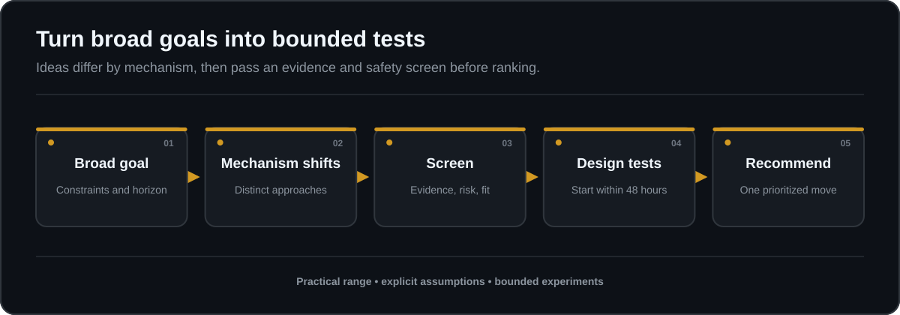

# Unconventional Moves

Turn a broad goal into a ranked portfolio of small, testable moves.

Unconventional Moves is a dependency-free Codex skill for generating five to seven practical approaches that differ by mechanism, not just wording. Every idea includes a concrete action, the assumption that usually hides it, a reversible test that can begin within 48 hours, an evidence label, and clear bounds. The response finishes with exactly one recommended place to start.

It is built for people who want useful strategic range without losing discipline around evidence, risk, cost, or accountability.



## At a glance

| Input | Method | Output |
| --- | --- | --- |
| A goal, desired outcome, constraints, non-negotiables, and time horizon | Reframe the problem through distinct mechanisms, then screen and rank the candidates | Five to seven bounded experiments and one prioritized action |

The skill is especially useful when conventional advice has become repetitive, when a team needs several genuinely different options, or when the safest next step is to learn before making a larger commitment. The contract is checked by [`scripts/validate.py`](scripts/validate.py) and [`scripts/validate_plan.py`](scripts/validate_plan.py).

## Quick start

### 1. Install the skill

Copy this directory:

```text
skill/unconventional-moves
```

into the project where you want to use it:

```text
<project>/.agents/skills/unconventional-moves
```

The installed directory should contain `SKILL.md`, `agents/openai.yaml`, and the bundled `references/` schemas. No external dependencies, executable code, or assets are required.

### 2. Invoke it

Use the skill explicitly:

```text
Use $unconventional-moves to generate practical unconventional moves for my goal: [describe the goal, constraints, and desired outcome].
```

The included metadata also permits implicit invocation when a request clearly calls for practical unconventional approaches.

### Package and install

The package builder uses only the Python standard library and produces a
deterministic ZIP plus SHA-256 checksum:

```powershell
python .\scripts\validate.py
python .\scripts\package.py --output .\dist
Get-FileHash .\dist\unconventional-moves-0.2.0.zip -Algorithm SHA256
Expand-Archive .\dist\unconventional-moves-0.2.0.zip -DestinationPath .\dist\expanded
Copy-Item .\dist\expanded\unconventional-moves-0.2.0\skill\unconventional-moves $env:CODEX_HOME\skills\unconventional-moves -Recurse -Force
```

On Bash:

```bash
python3 scripts/validate.py
python3 scripts/package.py --output dist
sha256sum dist/unconventional-moves-0.2.0.zip
unzip -q dist/unconventional-moves-0.2.0.zip -d dist/expanded
cp -R dist/expanded/unconventional-moves-0.2.0/skill/unconventional-moves "$CODEX_HOME/skills/unconventional-moves"
```

Verify the checksum before copying. The package does not publish or change
remote metadata.

### 3. Give it a useful brief

For stronger results, include:

- the outcome you want;
- the main constraint;
- anything that must not change;
- the time or budget available; and
- who else could be affected.

If one missing detail would materially change safety or usefulness, the skill may ask one focused question. Otherwise it states its assumptions and proceeds.

For a copy-ready intake and planning worksheet, use
[`templates/worksheet.md`](templates/worksheet.md). A JSON plan can be checked
against [`schemas/moves.schema.json`](schemas/moves.schema.json).

## Author, review, and learn locally

The optional Python CLI adds a complete local workflow without model calls, accounts, or runtime dependencies. It supports both the original plan contract and an additive version 0.2 with measurable experiment bounds.

You can now record an explicit selection, draft correctly bound observations, review cumulative checkpoints, screen declared time/exposure limits, and audit declared source dates. Printable cards, self-contained JSON handoffs, and an offline HTML report make human review portable. Handoff verification checks internal consistency; it does not authenticate claims, consent, or approval.

For follow-through, record checkpoints into a new validated history, inspect activity intervals and missing or regressing measurements, review remaining bounds, and export an experiment debrief. Whole-history handoffs preserve earlier stop reasons. Portfolio CSV tables and optional start/duration filters help compare declared experiment scope without automatically ranking or selecting a move.

```sh
python scripts/moves.py init --output draft.json
python scripts/moves.py review draft.json
python scripts/moves.py render draft.json --output draft.md
python scripts/moves.py card draft.json --output card.json
python scripts/moves.py outcome draft.json examples/bounded-outcome.json
python scripts/moves.py compare draft.json examples/bounded-plan.json
python scripts/moves.py render draft.json --format html --output review.html
python scripts/moves.py handoff draft.json --output handoff.json
python scripts/moves.py verify-handoff handoff.json
```

These commands replay a **synthetic language-practice example**. The outcome fixture matches the unchanged initial draft only. Editing a plan requires a new card and honest observations tied to that revision. The synthetic outcome meets its numeric target but returns `stop_and_review` because its bounds are reached. No command runs an experiment, establishes consent, or authorizes continuation.

For editable drafts, observation fields, and interpretation, see the [local workflow](docs/local-workflow.md) and [experiment contract](docs/experiment-contract.md). The CLI accepts `--output` on each report command and refuses to overwrite files. Exit status 0 means the command produced its report, including reports that require stopping. Status 1 means invalid input or a file error; status 2 means invalid command arguments. Review warnings are editorial prompts, never proof of novelty, safety, or effectiveness.

## How the method works

### 1. Frame the operating problem

The skill separates the desired outcome from the current method. It identifies constraints, non-negotiables, affected people, and the relevant time horizon before proposing moves.

### 2. Change the mechanism

Instead of producing cosmetic variations, it searches across mechanisms such as:

- inversion;
- subtraction;
- incentive changes;
- constraint removal;
- neglected stakeholders;
- timing;
- precommitment; and
- asymmetric experiments.

A mechanism is used only when it fits the goal. Familiar advice is not relabeled as unconventional merely to fill the list.

### 3. Screen every candidate

Each move is checked for legality, honesty, reversibility, downside, and exposure to other people. Illegal, deceptive, reckless, exploitative, or unsafe moves are rejected and redirected toward a safer lawful alternative when possible.

### 4. Mark the evidence boundary

The skill distinguishes among:

- facts supported by the prompt or reliable sources;
- inferences drawn from those facts; and
- speculation that still needs testing.

It does not invent support for an idea or claim personal experience, access to private data, or inspection of training data.

### 5. Rank for learning and fit

Valid moves are ranked by likely learning value, reversibility, cost, and fit with the stated constraints. The final recommendation selects one move and names its first concrete step.

## Response contract

Every valid idea follows the same decision-ready structure:

```text
### Idea N: Title (mechanism)

- Concrete move: The action stated precisely.
- Why overlooked: The assumption, incentive, habit, stakeholder,
  constraint, or timing effect that hides it.
- 48-hour test: A tiny reversible test, including a success signal
  and a stop condition.
- Success signal: The observable result that supports continuation.
- Stop condition: The result, risk, or time boundary that ends the test.
- Evidence status: What is supported, inferred, or speculative.
- Bounds: Limits on time, cost, exposure, or commitment when material.
- Sources: Current reliable sources for high-stakes claims, or an explicit
  statement that no sources are required.
```

After the full set, the response ends with exactly one:

```text
Prioritized action: One selected idea, why it should go first,
and its first concrete step.
```

This format makes the output easier to compare, challenge, and act on. It also keeps novelty subordinate to evidence and bounded execution.

## Synthetic example prompts

The examples are fictional and contain no real person, organization, or product information.

### Reduce meeting overload

> Use $unconventional-moves to generate five safe ways a fictional remote team could reduce recurring meeting overload while preserving essential decisions and accountability. Vary the mechanisms, include a reversible 48-hour test and stop condition for every idea, and finish with one prioritized action.

### Validate a small product idea

> Use $unconventional-moves to generate seven low-cost, reversible ways a fictional maker could validate a small product idea before building it. Explain why each move is overlooked, label facts, inferences, and speculation, reject deceptive validation tactics, and select one action to start first.

### Make language practice consistent

> Use $unconventional-moves to generate six practical, non-obvious ways a fictional beginner could make language practice consistent during an irregular week. Name each mechanism, define a test that can begin within 48 hours, and prioritize one move.

More ready-to-use prompts are in [`examples/example-prompts.md`](examples/example-prompts.md).

## Safety and evidence screen

Novelty never overrides consent, legality, honesty, or safety.

| Gate | Required behavior |
| --- | --- |
| Legality and honesty | Reject illegal or deceptive moves |
| Reversibility | Prefer small tests that can be stopped without creating a larger commitment |
| Downside | State meaningful stop conditions and limit exposure |
| Other people | Consider consent, incentives, and third-party effects |
| Evidence | Separate supported facts from inference and speculation |
| High stakes | Use current reliable sources, prefer authoritative primary sources, and recommend qualified review when appropriate |

For health, safety, legal, financial, or similarly consequential goals, material factual claims require current reliable sources. If those sources are unavailable, the skill must say that verification is incomplete and limit the response to source gathering or other non-consequential steps.

## Sources

High-stakes output ends with a Sources section listing each current reliable
source, its URL, and the claim or boundary it supports. If a source cannot be
checked, state `Verification incomplete` and limit the response to source
gathering or a non-consequential experiment.

## Limitations

- Output quality depends on the clarity and accuracy of the supplied goal and constraints.
- Novelty is contextual. A move that is unusual in one environment may be routine in another.
- A 48-hour experiment can reduce uncertainty, but it cannot establish long-term success.
- Ranking is a reasoned judgment based on the available context, not a guarantee of results.
- The skill does not execute actions, verify private claims, or replace current authoritative sources or qualified professional advice.
- Unsafe goals may be refused or redirected instead of receiving a complete set of ideas.

## Repository map

```text
.
|-- README.md
|-- LICENSE
|-- SECURITY.md
|-- CONTRIBUTING.md
|-- PROVENANCE.md
|-- CHANGELOG.md
|-- VERSION
|-- docs/
|   `-- release-notes-v0.1.0.md
|-- schemas/
|   `-- moves.schema.json
|-- templates/
|   `-- worksheet.md
|-- scripts/
|   |-- validate.py
|   |-- validate_plan.py
|   `-- package.py
|-- examples/
|   |-- example-prompts.md
|   |-- example-plan.json
|   `-- adversarial-fixtures.json
`-- skill/
    `-- unconventional-moves/
        |-- SKILL.md
        `-- agents/
            `-- openai.yaml
```

| File | Purpose |
| --- | --- |
| [`skill/unconventional-moves/SKILL.md`](skill/unconventional-moves/SKILL.md) | Behavioral instructions and response contract |
| [`skill/unconventional-moves/agents/openai.yaml`](skill/unconventional-moves/agents/openai.yaml) | Display metadata, default prompt, and implicit-invocation policy |
| [`examples/example-prompts.md`](examples/example-prompts.md) | Ready-to-use synthetic prompts |
| [`examples/example-plan.json`](examples/example-plan.json) | Valid machine-readable plan fixture |
| [`examples/adversarial-fixtures.json`](examples/adversarial-fixtures.json) | Unsafe-goal and injection behavior fixtures |
| [`templates/worksheet.md`](templates/worksheet.md) | Copy-ready planning worksheet |
| [`schemas/moves.schema.json`](schemas/moves.schema.json) | JSON response contract |
| [`scripts/validate.py`](scripts/validate.py) | Repository contract and link checks |
| [`scripts/validate_plan.py`](scripts/validate_plan.py) | Dependency-light plan validator |
| [`scripts/package.py`](scripts/package.py) | Deterministic ZIP and checksum builder |
| [`SECURITY.md`](SECURITY.md) | Security scope and private-reporting guidance |
| [`CONTRIBUTING.md`](CONTRIBUTING.md) | Contribution rules and validation workflow |
| [`PROVENANCE.md`](PROVENANCE.md) | Origin, review, and independence disclosures |
| [`LICENSE`](LICENSE) | MIT License terms |

## Authorship and independence

EauDoon directed, reviewed, and takes responsibility for the result. This is an independent community project.

Released under the MIT License. See [`LICENSE`](LICENSE).
